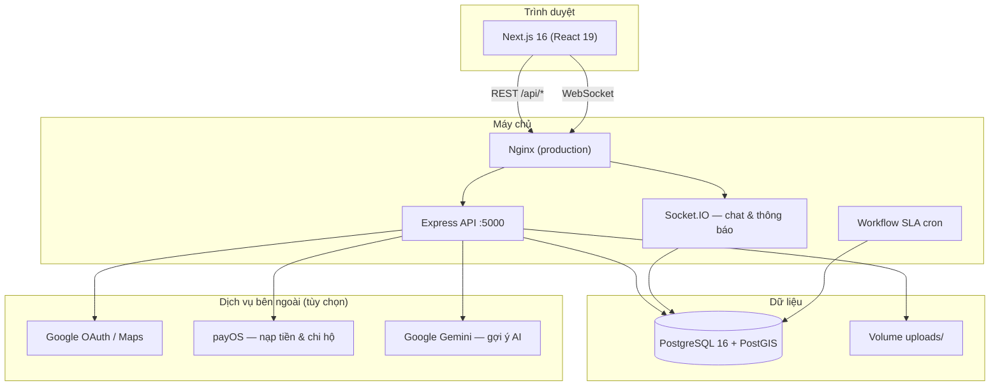

# Vĩnh Long Connect (VL Connected)

**Vĩnh Long Connect** là nền tảng kết nối trực tuyến giữa doanh nghiệp/người thuê và freelancer — bắt nguồn từ Vĩnh Long, hướng tới cộng đồng địa phương và mở rộng ra toàn quốc. Đồ án tốt nghiệp xây dựng một hệ sinh thái làm việc tự do minh bạch, an toàn và hiệu quả với thanh toán ký quỹ (SafePay/Escrow), quản lý hợp đồng theo giai đoạn và hỗ trợ trao đổi thời gian thực.

---

## Mục tiêu đồ án

| Mục tiêu | Mô tả |
|----------|--------|
| **Kết nối hai chiều** | Cho phép chủ việc đăng tin tuyển dụng/tìm freelancer và freelancer tìm việc/đăng gói dịch vụ trên cùng một nền tảng. |
| **Giao dịch an toàn** | Thanh toán qua ví VND và ký quỹ Escrow; giải ngân khi nghiệm thu, hỗ trợ hoàn tiền và xử lý tranh chấp. |
| **Quản lý công việc** | Theo dõi tiến độ hợp đồng theo từng giai đoạn (phòng làm việc), SLA tự động và thông báo thời gian thực. |
| **Xây dựng uy tín** | Xác minh danh tính, đánh giá công khai, hồ sơ freelancer và lịch sử hợp đồng minh bạch. |
| **Hỗ trợ quyết định** | So sánh báo giá, gợi ý AI (Gemini) và bản đồ địa điểm (Google Maps) khi cần. |

### Đối tượng sử dụng

- **Khách hàng / Doanh nghiệp:** đăng việc, nhận báo giá, chọn freelancer, nạp ký quỹ, nghiệm thu và đánh giá.
- **Freelancer:** đăng dịch vụ, ứng tuyển việc, gửi báo giá, bàn giao công việc và rút tiền từ ví.
- **Quản trị viên:** duyệt tài khoản, xử lý hoàn tiền/rút tiền, tranh chấp, báo cáo thống kê và cấu hình hệ thống.

---

## Kiến trúc hệ thống

Ứng dụng theo mô hình **client–server** với frontend và backend tách biệt, giao tiếp qua REST API và Socket.IO.



### Các module chính

| Thành phần | Vai trò |
|------------|---------|
| `app/`, `components/`, `lib/` | Giao diện người dùng (Next.js App Router), dashboard khách hàng/freelancer, trang admin |
| `backend/src/` | API Express: xác thực, việc làm, dịch vụ, hợp đồng, thanh toán, chat, thông báo |
| `backend/src/socket/` | Socket.IO cho tin nhắn và push thông báo |
| `Database.sql`, `backend/sql/` | Schema PostgreSQL và migration bổ sung |
| `docker/` | Dockerfile cho frontend, backend và khởi tạo PostGIS |
| `deploy/` | Script triển khai production (Droplet, Nginx, kiểm tra stack) |

### Luồng nghiệp vụ tóm tắt

1. Chủ việc đăng tin hoặc gửi yêu cầu báo giá → freelancer ứng tuyển/gửi báo giá.
2. Hai bên chốt hợp đồng → chủ việc nạp tiền ký quỹ (Escrow) qua payOS.
3. Freelancer thực hiện và bàn giao theo giai đoạn → chủ việc nghiệm thu → giải ngân.
4. Hệ thống SLA tự động xử lý hết hạn, nghiệm thu tự động và hoàn tiền khi đủ điều kiện.

---

## Công nghệ sử dụng

| Tầng | Công nghệ |
|------|-----------|
| Frontend | Next.js 16, React 19, TypeScript, Tailwind CSS 4, Socket.IO Client |
| Backend | Node.js 22, Express 4, Socket.IO 4, JWT, bcrypt |
| Cơ sở dữ liệu | PostgreSQL 16, PostGIS (địa điểm/vị trí) |
| Thanh toán | payOS (nạp ví, webhook, chi hộ) |
| Triển khai | Docker Compose, Nginx reverse proxy |
| Tích hợp (tùy chọn) | Google OAuth, Google Maps, Google Gemini |

---

## Yêu cầu phần mềm

### Phát triển cục bộ (`npm run dev`)

| Phần mềm | Phiên bản khuyến nghị |
|----------|------------------------|
| **Node.js** | 20.x trở lên (production Docker dùng 22) |
| **npm** | 10.x trở lên |
| **PostgreSQL** | 16+ với extension **PostGIS** |
| **Git** | Mới nhất |

### Triển khai bằng Docker (khuyến nghị cho production)

| Phần mềm | Ghi chú |
|----------|---------|
| **Docker** | 24+ |
| **Docker Compose** | v2 |
| **Nginx** | Tùy chọn trên server; cấu hình mẫu tại `deploy/nginx-minhlu.app.conf` |

### Tài khoản/dịch vụ tùy chọn

- **Google Cloud Console** — OAuth đăng nhập Google, Maps API Key
- **payOS** — nạp tiền ví và webhook thanh toán
- **Google AI Studio** — API key Gemini cho gợi ý so sánh báo giá

---

## Cài đặt và chạy chương trình

### 1. Clone repository

```bash
git clone <url-repository>
cd vl-connected
```

### 2. Cấu hình biến môi trường

Sao chép file mẫu và chỉnh sửa theo môi trường của bạn:

```bash
cp .env.example .env
```

Các biến **bắt buộc** tối thiểu:

- `DB_HOST`, `DB_PORT`, `DB_NAME`, `DB_USER`, `DB_PASSWORD` — kết nối PostgreSQL
- `JWT_ACCESS_SECRET`, `JWT_REFRESH_SECRET` — mã bí mật JWT (tối thiểu 32 ký tự)
- `FRONTEND_URL`, `NEXT_PUBLIC_API_URL` — URL frontend và API mà trình duyệt gọi được

> **Lưu ý:** Khi chạy `npm run dev` với Postgres cài trên máy, đặt `DB_HOST=localhost`. Khi chạy Docker Compose, đặt `DB_HOST=db` và dùng `DB_USER`/`DB_NAME` theo `.env.example`.

### 3. Khởi tạo cơ sở dữ liệu

**Cách A — Postgres local:**

1. Tạo database (ví dụ `vl_freelancer`).
2. Bật PostGIS: `CREATE EXTENSION IF NOT EXISTS postgis;`
3. Import schema: `psql -U postgres -d vl_freelancer -f Database.sql`
4. (Tùy chọn) Chạy các file migration trong `backend/sql/` nếu cần.

**Cách B — Docker Compose (tự khởi tạo):**

Docker sẽ mount `Database.sql` và `backend/sql/` vào container `db` khi volume mới được tạo lần đầu.

### 4. Cài đặt dependencies

```bash
# Frontend (thư mục gốc)
npm install

# Backend
npm install --prefix backend
```

### 5. Chạy ở chế độ phát triển

Lệnh sau khởi động **đồng thời** frontend (cổng 3000) và backend (cổng 5000):

```bash
npm run dev
```

Hoặc chạy riêng từng phần:

```bash
npm run dev:fe   # Next.js → http://localhost:3000
npm run dev:be   # Express API → http://localhost:5000
```

Kiểm tra API:

```bash
curl http://localhost:5000/health
```

Kết quả mong đợi: `{"ok":true,"service":"vl-connected-api","database":"connected"}`

### 6. Chạy bằng Docker Compose

```bash
# Đảm bảo .env đã cấu hình (DB_HOST=db cho Docker)
docker compose up -d --build

# Xem trạng thái
docker compose ps

# Xem log
docker compose logs -f
```

Hoặc dùng npm script:

```bash
npm run docker:up
npm run docker:ps
npm run docker:logs
npm run docker:down
```

Sau khi container healthy:

- Frontend: http://localhost:3000
- Backend API: http://localhost:5000
- PostgreSQL: localhost:5432 (theo `POSTGRES_PORT` trong `.env`)

### 7. Build production (không Docker)

```bash
# Frontend
npm run build
npm start

# Backend (terminal riêng)
npm --prefix backend start
```

---

## Cấu trúc thư mục

```
vl-connected/
├── app/                    # Next.js App Router (trang, layout)
├── components/             # React components theo module nghiệp vụ
├── lib/                    # API client, i18n, routes, utilities
├── hooks/                  # React hooks
├── backend/
│   ├── src/
│   │   ├── controllers/    # Xử lý nghiệp vụ
│   │   ├── routes/         # Định tuyến REST API
│   │   ├── socket/         # Socket.IO (chat)
│   │   ├── middleware/     # Upload, auth, ...
│   │   └── utils/          # Thanh toán, thông báo, SLA, ...
│   ├── sql/                # Migration SQL bổ sung
│   └── uploads/            # File tải lên (avatar, hồ sơ, chat, ...)
├── docker/                 # Dockerfile & script init DB
├── deploy/                 # Script triển khai server
├── Database.sql            # Schema PostgreSQL đầy đủ
├── docker-compose.yml
├── .env.example            # Mẫu biến môi trường
└── package.json
```

---

## Triển khai production

Trên server Ubuntu (ví dụ DigitalOcean Droplet):

```bash
bash deploy/deploy-droplet.sh
```

Script sẽ `git pull`, copy cấu hình `.env`, build và chạy Docker Compose, kiểm tra health backend/DB và cập nhật Nginx nếu có.

Các lệnh hỗ trợ khác:

```bash
sh deploy/check-stack.sh   # Kiểm tra backend, frontend, Nginx, Socket.IO
sh deploy/verify-db.sh       # Kiểm tra kết nối và bảng DB
sh deploy/reset-db.sh        # Reset volume DB (mất dữ liệu — cẩn thận)
```

Cấu hình Nginx mẫu: `deploy/nginx-minhlu.app.conf` — proxy `/api`, `/uploads`, `/socket.io` về backend và phục vụ frontend.

---

## API và tích hợp

| Endpoint / tính năng | Mô tả |
|----------------------|--------|
| `GET /health` | Kiểm tra API và kết nối database |
| `/api/auth` | Đăng ký, đăng nhập, JWT, Google OAuth |
| `/api/jobs`, `/api/services` | Tin tuyển dụng và gói dịch vụ |
| `/api/contracts` | Hợp đồng, giai đoạn, bàn giao |
| `/api/payments` | Ví, Escrow, payOS webhook |
| `/api/chat` + Socket.IO | Tin nhắn thời gian thực |
| `/api/notifications` | Thông báo trong ứng dụng |
| `/api/admin` | Quản trị hệ thống |

Nếu chưa cấu hình Google OAuth, payOS hoặc Gemini, backend vẫn chạy nhưng các tính năng tương ứng sẽ bị giới hạn (có cảnh báo trong log khi khởi động).

---

## Tài liệu bổ sung

- `docs/workflow-sla-checklist.md` — quy trình SLA hợp đồng
- `components/about/aboutData.ts` — sứ mệnh, tầm nhìn và giá trị cốt lõi của nền tảng
- `components/how-vlc-works/` — hướng dẫn quy trình cho người thuê và freelancer

---

## Giấy phép

Đồ án tốt nghiệp — sử dụng cho mục đích học tập và nghiên cứu.
