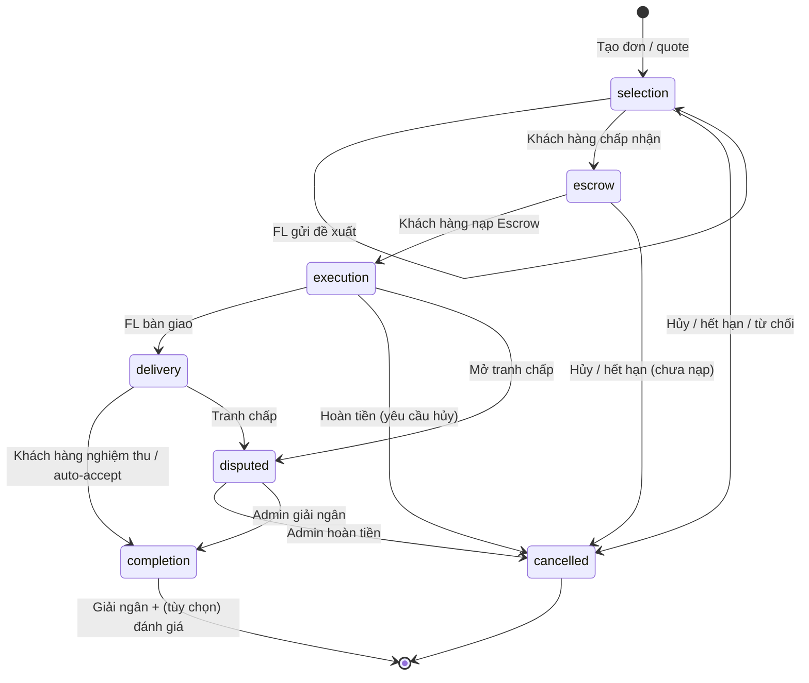

# State machine — Workflow đơn dịch vụ (SLA)

## SLA tự động

| Giai đoạn | Trigger | Hành động |
|-----------|---------|-----------|
| selection (chờ đề xuất) | 7 ngày | `cancel_type=expired` |
| selection (chờ accept) | 7 ngày từ `proposal_submitted_at` | `expired` |
| escrow | 5 ngày | `expired` |
| execution | Khách hàng `request_cancel_refund`, FL im lặng 3 ngày | Hoàn 100% |
| delivery | 7 ngày sau `delivered_at` | Auto-accept + release |

## API actions mới

- `withdraw_proposal`, `reject_proposal`, `cancel_order`
- `request_cancel_refund`, `respond_cancel_request`
- `open_dispute`

Admin resolve: `npm run workflow:resolve-dispute -- <id> full_refund|release|dismiss`

Cron: `npm run workflow:sla` hoặc tự chạy mỗi giờ trong backend.
